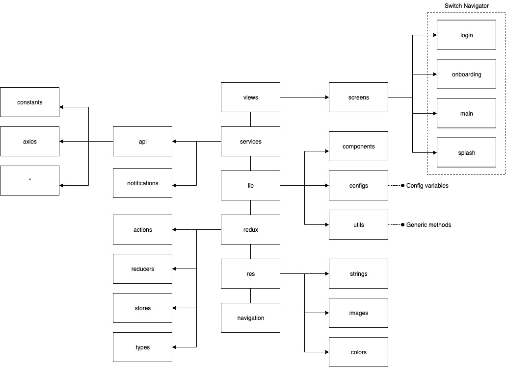

React Web Boillerplate
====================================
# Overview
This is a React Web Boillerplate with custom components and login function with redux.

# Dependencies
* [axios](https://github.com/axios/axios)
* [@fortawesome/fontawesome-free](https://fontawesome.com)
* [memoize-one](https://github.com/alexreardon/memoize-one#readme)
* [react-google-login](https://github.com/anthonyjgrove/react-google-login)
* [react-router-dom](https://github.com/ReactTraining/react-router#readme)
* [reactstrap](https://github.com/reactstrap/reactstrap#readme)
* [react-redux](https://github.com/reduxjs/react-redux)
* [redux](https://github.com/reduxjs/redux)
* [redux-thunk](https://github.com/reduxjs/redux-thunk)
* [validator](https://github.com/chriso/validator.js)

# Node version
Communicates with backend who has node version v9.10.1
# Npm version
v6.13.1
# Structure

## Services
API calls, push notifications and everything that comes from outside.
## Lib
Config variables and generic methods.
## Redux
Everything related to redux, actions, reducers, stores and types.
## Res
All application texts in their language variations, colors and assets (images, fonts, etc.).
## Components
Reusable components without redux.
## Containers
Reusable components connected to redux that make up a screen.

# Installation & Usage
* Download the repo `git clone git@bitbucket.org:zircon-tech/react-web-bolilerplate.git`
* `cd react-web-bolilerplate`
* Install project dependencies `npm i`.
* Create `.env` file on the root following the `.env.example` file
* Run project
  * `npm start`

# Secrets (.env file)
```
API_URL= SERVER URL WHERE API LIVE (example: localhost)
API_PORT= SERVER PORT (example: 3000)
API_KEY= SERVER KEY FOR HEADER SECURITY
```